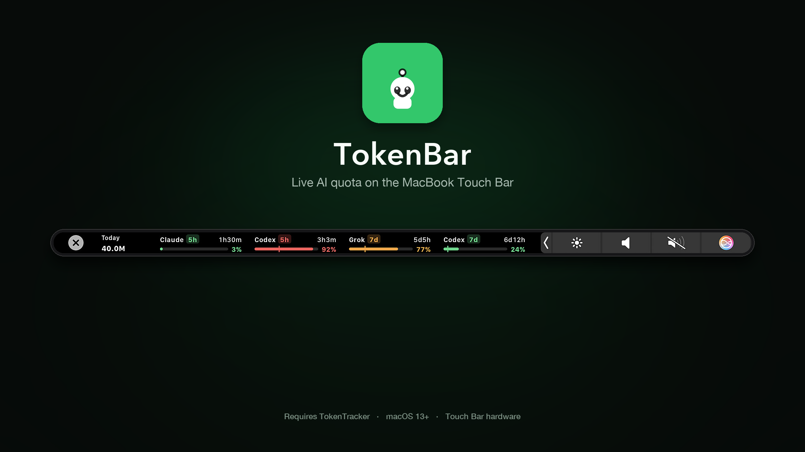
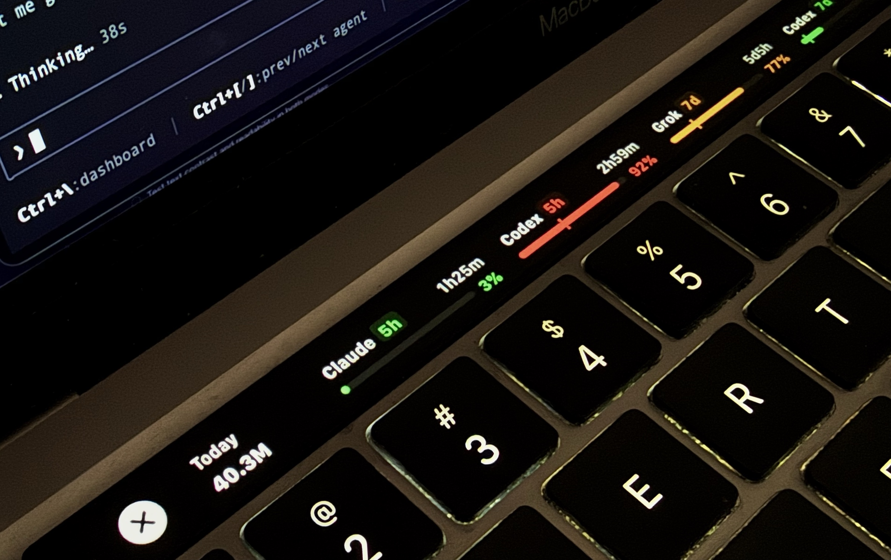

<p align="center">
  
</p>

<p align="center">
  
  
  
  
</p>

<p align="center">
  <strong>A menu-bar companion that draws live AI quota on the Touch Bar.</strong><br>
  Countdowns, 5h / 7d tags, usage bars, and today’s tokens — without leaving the keyboard.
</p>

<p align="center">
  TokenBar does <strong>not</strong> track usage. It polls <a href="https://github.com/xiufengsun/TokenTracker">TokenTracker</a> on <code>127.0.0.1</code>.<br>
  TokenTracker has to be running or the bot turns red.
</p>

<p align="center">
  
</p>
<p align="center">
  <sub>On a MacBook Pro with Touch Bar</sub>
</p>

## Features

| Feature | What you get |
|:--|:--|
| **Control Strip bot** | Hops in the Control Strip. Green / orange / red follows the hottest visible window. Tap to expand. |
| **Quota chips** | Provider, 5h / 7d tag, countdown, usage bar, even-burn pace tick, percent used. |
| **Today / Cost** | Billable tokens and estimated USD, matching TokenTracker’s account + timezone totals. Hide either from the menu. |
| **Reset pulse** | A chip flashes and the bot hops harder when a window resets. |
| **Menu bar** | Tiny bot only. Pick chips, pin the strip, bounce on/off, launch at login, About, Quit. |

Tap a quota chip to open TokenTracker’s limits page. Tap Today or Cost to open the dashboard.

## Download & Install

You need **two apps** and a **MacBook with a Touch Bar**.

1. **[TokenTracker](https://github.com/xiufengsun/TokenTracker)** — tracks usage and serves it locally  
2. **TokenBar** — this app, which draws that data on the Touch Bar

TokenBar will not show any chips until TokenTracker is installed **and running**.

The supported way to install TokenBar is **clone and build on the Mac that will run it**. A local build is not quarantined, so Gatekeeper does not block it. The GitHub DMG is unsigned (ad-hoc) and is optional.

---

### 1. Install TokenTracker

TokenBar is a companion. It only polls TokenTracker’s local server at `http://127.0.0.1:7680`. Full docs: [github.com/xiufengsun/TokenTracker](https://github.com/xiufengsun/TokenTracker).

**macOS app (recommended)**

1. **Download** [`TokenTrackerBar.dmg`](https://github.com/xiufengsun/TokenTracker/releases/latest/download/TokenTrackerBar.dmg) from [TokenTracker Releases](https://github.com/xiufengsun/TokenTracker/releases/latest)
2. **Open** the disk image
3. **Move** `TokenTracker.app` to your `/Applications` folder
4. **Open TokenTracker.** A menu-bar icon appears. Leave it running.

Or with Homebrew:

```bash
brew install --cask xiufengsun/tokentracker/tokentracker
open /Applications/TokenTracker.app
```

**CLI only** (if you do not want the TokenTracker menu-bar app):

```bash
npm i -g tokentracker-cli
tokentracker serve
```

First-run alternative: `npx tokentracker-cli`

**Confirm it is up:**

```bash
curl -sS http://127.0.0.1:7680/functions/tokentracker-usage-limits | head
```

If that fails, TokenBar’s Control Strip bot turns red and the menu says TokenTracker is not running.

> TokenBar is a separate project. It is not affiliated with TokenTracker, Anthropic, OpenAI, or xAI.

---

### 2. Install TokenBar (recommended)

**Requirements:** a Touch Bar Mac (see [Hardware](#hardware)), macOS 13+, TokenTracker already running on port `7680`, and [Xcode Command Line Tools](https://developer.apple.com/download/all/) (`swift --version` — full Xcode.app is not required).

```bash
xcode-select --install          # once, if `swift` is missing
git clone https://github.com/jashjacob/TokenBar.git
cd TokenBar
./scripts/install.sh
```

That builds a release `.app`, ad-hoc signs it, copies it to `/Applications/TokenBar.app`, and launches it. The TokenBar bot appears in the Control Strip and the menu bar. Tap the Control Strip bot to expand the quota chips.

Update later:

```bash
cd TokenBar
git pull
./scripts/install.sh
```

Logs: `~/Library/Logs/TokenBar.log`

Other build commands (from the repo root, TokenTracker must already be up):

- `swift build -c release` then [`scripts/package-app.sh`](scripts/package-app.sh) → `dist/TokenBar.app`
- [`scripts/release.sh`](scripts/release.sh) → `dist/TokenBar-<version>.dmg`
- `swift run TokenBar --once` — one-shot dump, no menu bar

---

### 3. Disk image (optional)

The [Releases](https://github.com/jashjacob/TokenBar/releases/latest) DMG is **not** Developer ID signed and **not** notarized. macOS will usually block a downloaded copy (*“Apple cannot check it for malicious software”*). Prefer step 2.

If you still use the DMG: open it, drag `TokenBar.app` to `/Applications`, then System Settings → **Privacy & Security** → **Open Anyway**, or right-click → **Open**, or `xattr -cr /Applications/TokenBar.app`.

## Hardware

TokenBar is for **MacBook Pro models that still have a Touch Bar**, on **macOS 13 Ventura or later**.

It will not appear on 14" / 16" MacBook Pro (2021+), Air, mini, Studio, or Studio Display.

| | Touch Bar | Runs TokenBar |
|:--|:--|:--|
| 13" / 15" **2016** | Yes | No — those Macs stop at macOS 12 |
| 13" / 15" **2017** | Yes | Yes, on Ventura 13 |
| 13" / 15" **2018–2019** | Yes | Yes |
| 16" **2019** | Yes | Yes, including macOS 26 |
| 13" Intel **2020** | Yes | Yes |
| 13" **M1 2020** (`MacBookPro17,1`) | Yes | Yes — developed here, on macOS 26 |
| 13" **M2 2022** (`Mac14,7`) | Yes | Yes — last Touch Bar Mac Apple sold |
| 13" 2016 / 2017 **two-port** | No | Menu bar only, no strip |

The 2016 two-port and 2017 two-port 13" models never had a Touch Bar.

## Use

1. Start TokenTracker and wait until its menu bar is live.
2. Open TokenBar. The bot appears in the Control Strip.
3. Tap the bot — or leave **Pin Touch Bar** on — to keep the chip strip up.
4. TokenBar menu (the same bot) → uncheck chips you do not want.
5. **Launch at Login** if you want it after reboot. TokenTracker still has to start too.

If the strip is in the way of Terminal’s Touch Bar, tap the system **X** on the left. Tap the bot to bring TokenBar back.

Default port is **7680**. Override with `defaults write com.jashjacob.TokenBar tokenTrackerPort -int <port>`.

## For coding agents

Follow this when asked to install or set up TokenBar. Do not download `TokenBar-*.dmg`.

TokenBar does **not** track usage. It polls TokenTracker on `127.0.0.1`. Do **not** clone or vendor [TokenTracker](https://github.com/xiufengsun/TokenTracker) unless the user asks; only make sure it is running.

1. **Host.** macOS 13+ and a Touch Bar Mac (`sysctl -n hw.model`). If the model has no Touch Bar, stop and say so. Full Xcode is not required; `swift` from Command Line Tools is.
2. **TokenTracker must answer.** Run:

   ```bash
   curl -sf -o /dev/null -w "%{http_code}" http://127.0.0.1:7680/functions/tokentracker-usage-limits
   ```

   Expect `200`. If it fails: open `/Applications/TokenTracker.app` if present; else `brew install --cask xiufengsun/tokentracker/tokentracker && open /Applications/TokenTracker.app`; else `npm i -g tokentracker-cli && tokentracker serve --no-open`. Retry curl until `200`. Do not start TokenBar first.
3. **Swift.** If `swift` is missing, run `xcode-select --install` and wait. Do not switch TokenBar’s ad-hoc sign to an Apple Development identity.
4. **Install TokenBar** from this repo (clone if needed):

   ```bash
   git clone https://github.com/jashjacob/TokenBar.git
   cd TokenBar
   ./scripts/install.sh
   ```

   That kills any old TokenBar, writes `/Applications/TokenBar.app`, and launches it.
5. **Verify.** `pgrep -x TokenBar` is non-empty. `~/Library/Logs/TokenBar.log` has a `TokenBar <version> (<build>) starting` line. The Control Strip bot should appear; chips stay empty until TokenTracker is up.

Port override (only if the user asked): `defaults write com.jashjacob.TokenBar tokenTrackerPort -int <port>`. Default is `7680`.

## How it talks to TokenTracker

| Endpoint | Used for |
|---|---|
| `GET /functions/tokentracker-usage-limits` | Quota windows (percent, reset time) |
| `GET /functions/tokentracker-usage-summary?from=&to=&tz=&tz_offset_minutes=&account=1` | Today tokens + cost |

## Private APIs

Public `NSTouchBar` only appears while an app is focused, which is useless for an always-on quota strip. TokenBar uses undocumented Control Strip / system-modal symbols from `DFRFoundation`:

- `presentSystemModalTouchBar:systemTrayItemIdentifier:`
- `addSystemTrayItem:`
- `DFRElementSetControlStripPresenceForIdentifier`
- `DFRSystemModalShowsCloseBoxWhenFrontMost`

That means it is **not App Store eligible**, can break on a macOS update, and overlays other apps’ Touch Bars while pinned. Use at your own risk.

## License

MIT. See [LICENSE](LICENSE). Built by Jash Jacob.

TokenTracker is also MIT. This repo does not vendor TokenTracker’s source; it only calls the local HTTP API while TokenTracker is running.

Personal companion app. Tested on one Touch Bar Mac against TokenTracker 0.96.x. No Sparkle updates, no notarized releases yet.
