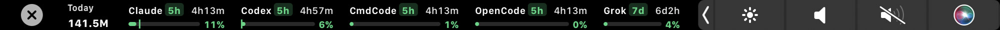
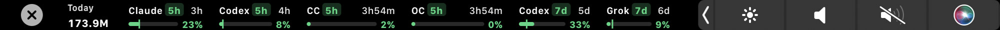

# TokenBar

Live AI quota on the MacBook Touch Bar. Countdowns, 5h / 7d tags, usage bars, today’s tokens.

TokenBar doesn’t track anything. It reads [TokenTracker](https://github.com/xiufengsun/TokenTracker) on your machine (`127.0.0.1:7680`) and draws it on the Touch Bar. If TokenTracker isn’t running, the bot turns red.

<p align="center">
  
</p>
<p align="center">
  
</p>
<p align="center">
  
</p>
<p align="center"><sub>Real Touch Bar, on a MacBook Pro</sub></p>

The Control Strip bot hops and changes colour with the hottest window. Tap it to expand the chips. Tap a chip to open TokenTracker. Hide whatever you don’t want from the menu.

## Install

You need a **MacBook with a Touch Bar**, **macOS 13+**, and **TokenTracker already running**.

You don’t need the Xcode app or an Apple developer account.

### 1. TokenTracker

Install the [Mac app](https://github.com/xiufengsun/TokenTracker/releases/latest) (or `brew install --cask xiufengsun/tokentracker/tokentracker`) and leave it running.

```bash
curl -sS http://127.0.0.1:7680/functions/tokentracker-usage-limits | head
```

That should return JSON. If it doesn’t, TokenBar has nothing to show.

CLI-only: `npm i -g tokentracker-cli` then `tokentracker serve`.

TokenBar isn’t affiliated with TokenTracker.

### 2. TokenBar

```bash
xcode-select --install   # only if `swift` is missing
git clone https://github.com/jashjacob/TokenBar.git
cd TokenBar
./scripts/install.sh
```

That’s the whole install. It builds on this Mac, puts `TokenBar.app` in `/Applications`, and launches it. A bot shows up in the Control Strip and the menu bar.

To update later: `git pull` then `./scripts/install.sh` again.

There’s a [DMG on Releases](https://github.com/jashjacob/TokenBar/releases/latest) if you want one. It’s unsigned, so macOS will likely block it. Building with `install.sh` is the path that actually works.

Logs live at `~/Library/Logs/TokenBar.log`.

## Use

1. Start TokenTracker, then TokenBar.
2. Tap the Control Strip bot (or leave **Pin Touch Bar** on).
3. Uncheck chips you don’t want from the TokenBar menu.
4. **Launch at Login** if you want it after reboot — TokenTracker has to start too.

If the strip is in the way, tap the system **X**. Tap the bot to bring it back.

Default port is `7680`. To change it: `defaults write com.jashjacob.TokenBar tokenTrackerPort -int <port>`.

## Fallbacks

TokenBar reads TokenTracker first. That feed sometimes comes back stale, empty, or with an error, so a chip disappears even though you are still signed in. A fallback asks the tool itself for the missing windows, and then owns every window for that tool. Command Code, OpenCode, Grok, and Cursor do that now. The others are still to come.

| Tool | Fallback |
|---|---|
| Claude | Not yet |
| Grok | In |
| ChatGPT / Codex | Not yet |
| Antigravity | Not yet |
| Cursor | In |
| OpenCode | In |
| Command Code | In |

## Hardware

Needs a MacBook Pro **with a Touch Bar**, on Ventura or later. Won’t show a strip on 14"/16" 2021+ Pros, Airs, minis, or Studios.

| | Touch Bar | TokenBar |
|:--|:--|:--|
| 13"/15" **2016** | Yes | No — those Macs stop at macOS 12 |
| 13"/15" **2017** | Yes | Yes, on Ventura |
| 13"/15" **2018–2019** | Yes | Yes |
| 16" **2019** | Yes | Yes |
| 13" Intel **2020** | Yes | Yes |
| 13" **M1 2020** | Yes | Yes — this is what it was built on |
| 13" **M2 2022** | Yes | Yes — last Touch Bar Mac |
| 13" 2016/2017 two-port | No | Menu bar only |

## For coding agents

Don’t download the DMG. Don’t clone TokenTracker unless asked.

1. Touch Bar Mac, macOS 13+. `sysctl -n hw.model` if unsure.
2. TokenTracker must return `200` from `http://127.0.0.1:7680/functions/tokentracker-usage-limits`. Open `/Applications/TokenTracker.app` or install it (`brew install --cask xiufengsun/tokentracker/tokentracker`) before TokenBar.
3. `swift` from Command Line Tools. Then `./scripts/install.sh` from this repo.
4. Check `pgrep -x TokenBar` and `~/Library/Logs/TokenBar.log`.

Keep the ad-hoc signature. Don’t vendor TokenTracker.

## How it talks to TokenTracker

| Endpoint | Used for |
|---|---|
| `GET /functions/tokentracker-usage-limits` | Quota windows |
| `GET /functions/tokentracker-usage-summary?from=&to=&tz=&tz_offset_minutes=&account=1` | Today tokens + cost |

## Private APIs

Normal `NSTouchBar` only shows while an app is focused, so an always-on strip uses private Control Strip APIs. That means no App Store, and a macOS update could break it. Use at your own risk.

## License

MIT. Built by Jash Jacob.

Tested on one Touch Bar Mac against TokenTracker 0.97.x. Not notarized. No auto-updates.
