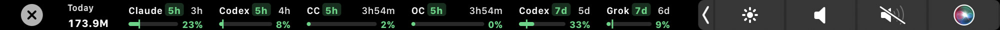
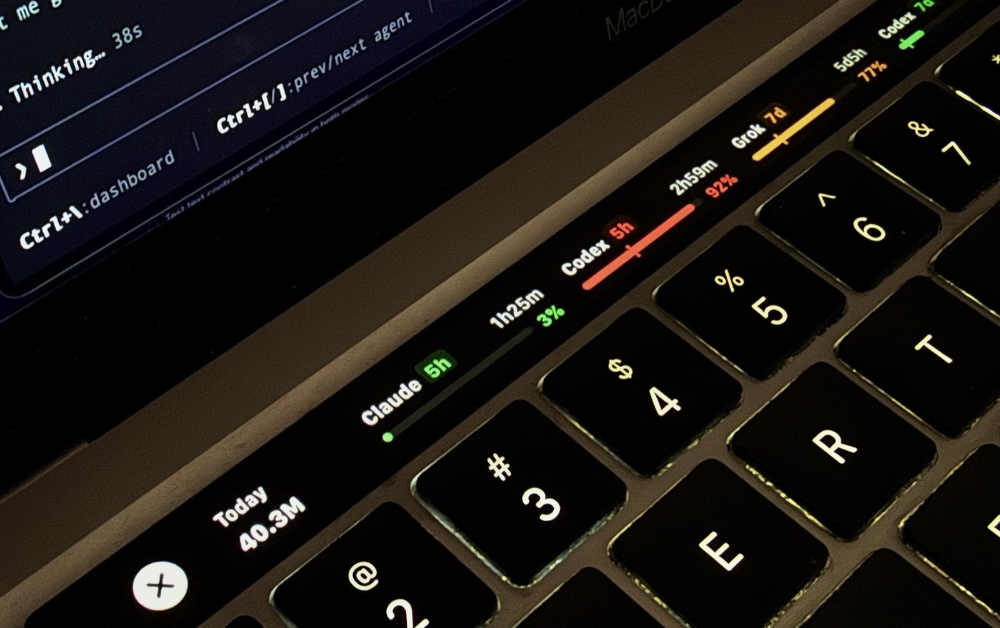

# TokenBar

See the quota before it runs out. Claude, Codex, Cursor, Grok, OpenCode, and Command Code, counting down on the Touch Bar.

<p align="center">
  
</p>
<p align="center">
  
</p>
<p align="center"><sub>On a MacBook Pro with a Touch Bar</sub></p>

Site: [jashjacob.github.io/TokenBar](https://jashjacob.github.io/TokenBar)

## Install

A Touch Bar Mac, macOS 13 or later. You don’t need the Xcode app.

```bash
git clone https://github.com/jashjacob/TokenBar.git
cd TokenBar
./scripts/install.sh
```

psst, make sure you have [TokenTracker](https://github.com/xiufengsun/TokenTracker) installed.

To update later: `git pull`, then `./scripts/install.sh` again.

## Fallbacks

TokenTracker sometimes comes back stale or empty. With **Use fallbacks** on in the menu, TokenBar asks that tool itself, using the login already on the Mac. The fallback owns every window for that tool. It checks again after five minutes, not on every poll.

| Tool | Fallback |
|---|---|
| Command Code | In |
| OpenCode | In |
| Grok | In |
| Cursor | In |
| Kimi | In |
| Claude | Not yet |
| ChatGPT / Codex | In |
| Antigravity | In |

## For coding agents

Don’t download the DMG. Don’t clone TokenTracker unless asked.

1. Touch Bar Mac, macOS 13+.
2. TokenTracker must return `200` from `http://127.0.0.1:7680/functions/tokentracker-usage-limits` before you install TokenBar.
3. `./scripts/install.sh`
4. Check `pgrep -x TokenBar` and `~/Library/Logs/TokenBar.log`.

## License

MIT. [Built by Jash Jacob](https://jashjacob.com).
